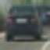
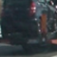
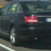
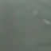
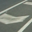
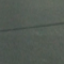
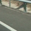

## Writeup Template
### You can use this file as a template for your writeup if you want to submit it as a markdown file, but feel free to use some other method and submit a pdf if you prefer.

---

**Vehicle Detection Project**

The goals / steps of this project are the following:

* Perform a Histogram of Oriented Gradients (HOG) feature extraction on a labeled training set of images and train a classifier Linear SVM classifier
* Optionally, you can also apply a color transform and append binned color features, as well as histograms of color, to your HOG feature vector. 
* Note: for those first two steps don't forget to normalize your features and randomize a selection for training and testing.
* Implement a sliding-window technique and use your trained classifier to search for vehicles in images.
* Run your pipeline on a video stream (start with the test_video.mp4 and later implement on full project_video.mp4) and create a heat map of recurring detections frame by frame to reject outliers and follow detected vehicles.
* Estimate a bounding box for vehicles detected.

### Dependencies

This project requires **Python 3.5** and the following Python libraries installed:
- [NumPy](http://www.numpy.org/)
- [SciPy](http://www.scipy.org/)
- [Matplotlib](http://matplotlib.org/)
- [OpenCV](http://opencv.org/)
- [Scikit-image](http://scikit-image.org/)
- [Scikit-learn](http://scikit-learn.org/stable/index.html)
- [Moviepy](http://zulko.github.io/moviepy/)

### Folders and Files
- `Training data`: All the data is located in my other repo - [DataSets](https://github.com/kinshuk4/DataSets/tree/master/carnd-vehicle-detection-p5-data/data). This repo is located parallel to my current repo. So, I have to refer the folder: "../DataSets/carnd-vehicle-detection-p5-data/data[i]". i is currently is 1 and 2. That means I am taking 2 sources of data, whatever I can find on internet. Sources of data:
    - I got the data from [Vehicle Image Database](http://www.gti.ssr.upm.es/~jal/download.html). That is added to other repo called . 
 - `src`: All the reusable code is placed in src folder. This src folder is referred in the Jupyter notebook for setting up the pipeline.
 - `VehicleDetectionWorkbook.ipynb`: My actual code using the src package.
 - `test_images`: Folder to hold test images.
 - `output_images`: Folder to hold examples of the output from each stage of the image processing pipeline. It also contains the video output.

[//]: # (Image References)
[image1]: ./examples/car_not_car.png
[image2]: ./examples/HOG_example.jpg
[image3]: ./examples/sliding_windows.jpg
[image4]: ./examples/sliding_window.jpg
[image5]: ./examples/bboxes_and_heat.png
[image6]: ./examples/labels_map.png
[image7]: ./examples/output_bboxes.png
[video1]: ./project_video.mp4
[video2]: ./out_project_video.mp4

## [Rubric](https://review.udacity.com/#!/rubrics/513/view) Points
###Here I will consider the rubric points individually and describe how I addressed each point in my implementation.  


---
### Writeup / README

#### 1. Provide a Writeup / README that includes all the rubric points and how you addressed each one.  You can submit your writeup as markdown or pdf.  [Here](https://github.com/udacity/CarND-Vehicle-Detection/blob/master/writeup_template.md) is a template writeup for this project you can use as a guide and a starting point.  

You're reading it!

### Histogram of Oriented Gradients (HOG)

#### 1. Explain how (and identify where in your code) you extracted HOG features from the training images.

The code for extracting HOG features is defined in the `get_hog_features(image, orient, pix_per_cell, cell_per_block, vis=False, feature_vec=True):` function located in `feature_extractor.py`.

I started by reading in all the `vehicle` and `non-vehicle` images.  Here is an example of one of each of the `vehicle` and `non-vehicle` classes:

vehicle | non-vehicle        
----|-------
    |   

I then explored different color spaces and different `skimage.hog()` parameters (`orientations`, `pixels_per_cell`, and `cells_per_block`).  I grabbed random images from each of the two classes and displayed them to get a feel for what the `skimage.hog()` output looks like.

Here is an example using the `YCrCb` color space and HOG parameters of `orientations=10`, `pixels_per_cell=(8, 8)` and `cells_per_block=(2, 2)`:


![alt text][image2]

#### 2. Explain how you settled on your final choice of HOG parameters.

I tried various combinations of parameters. I set the orientation from 8 to 12, but there was not much improvement. So, I kept it 10. Also, I tried the color spaces(RGB, HLS, HSV, LUV, YUV, YCrCb and grayscale) and the classifier gave the most unique features for YCrCb channel.


Here is the final list of HOG Parameters:
```python
SPATIAL_SIZE = (32, 32)
HIST_BINS = 32
ORIENT = 10
PIXELS_PER_CELL = 10
CELL_PER_BLOCK = 2
DEFAULT_COLOR_SPACE = 'YCrCb'
DEFAULT_HOG_CHANNEL = 'ALL'
```

With this setting, the trained SVM classifier generates a test accuracy of 0.9972 on test data (20% of the whole data).

All the code can be found in `feature_extractor.py`.

#### 3. Describe how (and identify where in your code) you trained a classifier using your selected HOG features (and color features if you used them).

I trained a linear SVM using `LinearSVC` from skimage package, I call the `fit()` method of `LinearSVC`, pass in the training data, i use `hog` and color features for training the svm classifier.

All the code can be found in `preprocessing_classifier.py`. In the Jupyter notebook, the instance of the classifier is created and tested out. Here are the steps involved:

- Extract features from the image files
- Normalize the data using StandardScalar
- Fit the classifier on the normalized data 
- Verify the accuracy of classifier
- Save the training data to pickle

### Sliding Window Search

#### 1. Describe how (and identify where in your code) you implemented a sliding window search.  How did you decide what scales to search and how much to overlap windows?

Tthe sliding window is in the `feature_extractor.py` under `find_cars` function. For every image, it be scaled by some factor and use a 64 x 64 window search the vehicle start from some Y and then record that postion if there is a vehicle in that window.


![alt text][image3]

#### 2. Show some examples of test images to demonstrate how your pipeline is working.  What did you do to optimize the performance of your classifier?

Ultimately I searched on two scales using YCrCb 3-channel HOG features plus spatially binned color and histograms of color in the feature vector, which provided a nice result.  Here are some example images:

![alt text][image4]
---

### Video Implementation

#### 1. Provide a link to your final video output.  Your pipeline should perform reasonably well on the entire project video (somewhat wobbly or unstable bounding boxes are ok as long as you are identifying the vehicles most of the time with minimal false positives.)
Here's a  [input video](./project_video.mp4). After applying the `video_pipeline` I was able to get the following [video output](./out_project_video.mp4).


#### 2. Describe how (and identify where in your code) you implemented some kind of filter for false positives and some method for combining overlapping bounding boxes.

I recorded the positions of positive detections in each frame of the video.  From the positive detections I created a heatmap and then thresholded that map to identify vehicle positions.  I then used `scipy.ndimage.measurements.label()` to identify individual blobs in the heatmap.  I then assumed each blob corresponded to a vehicle.  I constructed bounding boxes to cover the area of each blob detected.  

Here's an example result showing the heatmap from a series of frames of video, the result of `scipy.ndimage.measurements.label()` and the bounding boxes then overlaid on the last frame of video:

### Here are six frames and their corresponding heatmaps:

![alt text][image5]

### Here is the output of `scipy.ndimage.measurements.label()` on the integrated heatmap from all six frames:
![alt text][image6]

### Here the resulting bounding boxes are drawn onto the last frame in the series:
![alt text][image7]


---

### Discussion

#### 1. Briefly discuss any problems / issues you faced in your implementation of this project.  Where will your pipeline likely fail?  What could you do to make it more robust?

The pipeline might fail once it will something strange in its vision. For example, the training data hardly has representation for trucks as vehicle, so if truck comes infront of vehicle, it may fail. It will definitely fail to recognize any humanoid or animal form coming infront of the car. Using the Neural Network can improve the model further.


